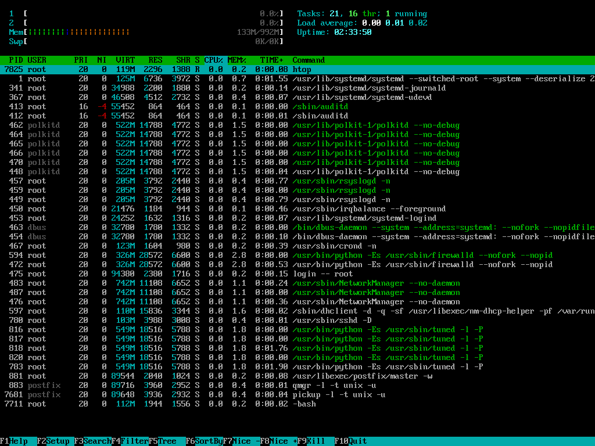

# vnc-screenshot

Small golang tool written around [mitchellh/go-vnc](https://github.com/mitchellh/go-vnc/). Supply a server
address and easily take a screenshot of whatever is running.



## Usage

```
$ ./vnc-screenshot --serverAddr 127.0.0.1:5959 --out asdf.png
Connected to VNC desktop: QEMU (rootfs-image) [res:1024x768]
```

## License

GPLv3
